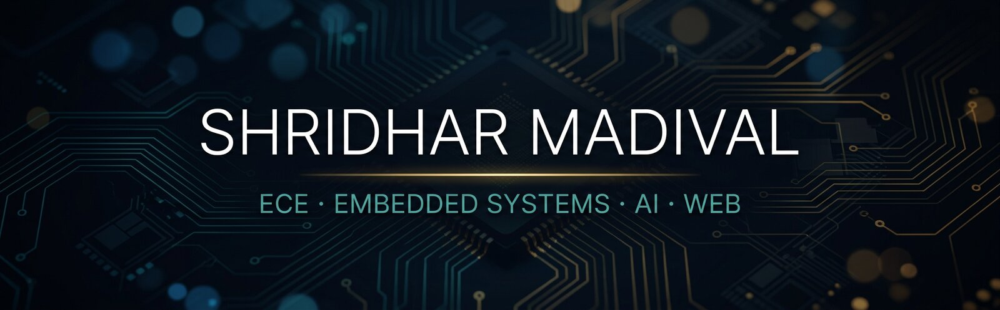
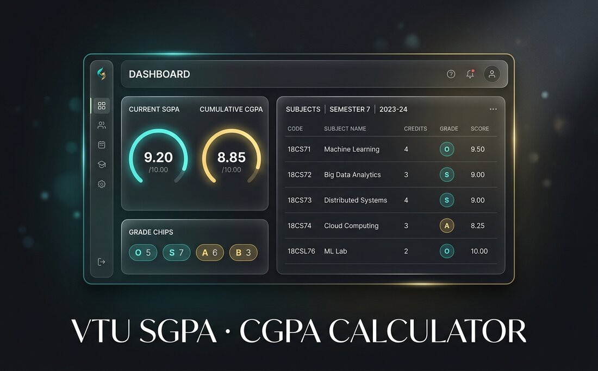
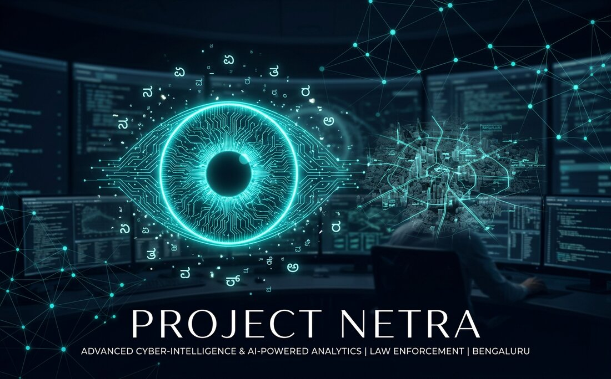

  

 

 

### About

I am **Shridhar Manjunath Madival**, an Electronics & Communication Engineering student at **AITM Bhatkal**. I care about the seam where hardware meets software — from ATmega328P firmware and LoRa marine safety to polished web tools and agentic AI for public systems.

Based between **Honnavar** and **Bengaluru**. Always shipping, always learning.

---

### Featured Work

<table>
  <tr>
    <td width="50%" valign="top">
      
      <h3 align="center">🧮 VTU SGPA · CGPA Calculator</h3>
      

        A calm, student-first calculator for VTU results — SGPA, CGPA, grade chips, and a dashboard that makes the numbers feel clear instead of chaotic.
      

      

        <code>Python</code>&nbsp;<code>Flask</code>&nbsp;<code>HTML</code>&nbsp;<code>CSS</code>&nbsp;<code>Web Design</code>
      

      

        <a href="https://github.com/shridhar-1/VTU-SGPA-CGPA-CALCULATOR"><strong>View Repository →</strong></a>
        &nbsp;·&nbsp;
        <a href="https://vtu-sgpa-cgpa-calculator.onrender.com/"><strong>Live App →</strong></a>
      

    </td>
    <td width="50%" valign="top">
      
      <h3 align="center">👁️ Project Netra</h3>
      

        Flagship intelligence platform for Karnataka State Police — Kannada voice search, graph-powered analysis, 3D predictive mapping, and hallucination-safe summaries.
      

      

        <code>HTML</code>&nbsp;<code>Node.js</code>&nbsp;<code>Zoho Catalyst</code>&nbsp;<code>Agentic AI</code>
      

      

        <a href="https://github.com/shridhar-1/Project-Netra"><strong>View Repository →</strong></a>
      

    </td>
  </tr>
</table>

<strong>More projects</strong>

 

| Project | What it is | Stack |
| :--- | :--- | :--- |
| [Sagar Raksha](https://github.com/shridhar-1/Sagar-Raksha-Android-Interface-) | Real-time marine safety & long-range distress signaling | LoRa · Hardware · Android |
| [raksha_tech](https://github.com/shridhar-1/raksha_tech) | Fuel-efficiency tooling | HTML · Web |
| [Hostel Complaint System](https://github.com/shridhar-1/Hostel-Complaint-System) | Campus issue tracking for hostels | HTML |
| [3D Portfolio](https://github.com/shridhar-1/3D_Portfolio) | Immersive 3D personal site | TypeScript |
| [shridhar-portfolio](https://github.com/shridhar-1/shridhar-portfolio) | Official portfolio — IoT, electronics, coding | HTML |

---

### Toolkit

  

  
  
  
  
  
  

---

### Pulse

  
  

  

---

**Let’s build something that lasts.**

[shridharmadival.in](https://www.shridharmadival.in/) · [GitHub](https://github.com/shridhar-1) · [LinkedIn](https://www.linkedin.com/in/shridharmadival)

